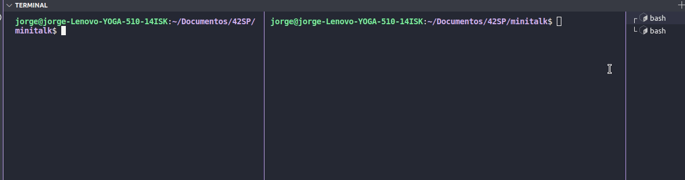
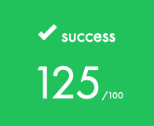

# minitalk

## Badge

## Skills
- Unix
- Rigor

# Demo

## My grade

## Cloning

git clone https://github.com/jorgeedualves/minitalk.git  
cd 42-minitalk  
make   

## Compiling

First you launch server:  
$ ./server  
Server will print its PID and wait  

So you use the client to send string or unicode characters to the server  
$ ./client `PID_SERVER` `STRING`   

## Subject

The purpose of this project is to code a small data exchange program using UNIX signals.  

**Mandatory Part**  
• You must create a communication program in the form of a client and server.   
• The server must be launched first, and after being launched it must display its PID.  
• The client will take as parameters:  
• The server PID.  
• The string that should be sent.  
• The client must communicate the string passed as a parameter to the server.  
• Once the string has been received, the server must display it.  
• Communication between your programs should ONLY be done using UNIX signals.  
• The server must be able to display the string pretty quickly. By quickly we mean that if you think it is too long,  
then it is probably too long (hint: 1 second   for 100 characters is COLOSSAL)  
• Your server should be able to receive strings from several clients in a row, without needing to be restarted.  
• You can only use the two signals SIGUSR1 and SIGUSR2.   
**Bonus**  
• The server confirms every signal received by sending a signal to the client.  
• Support Unicode characters!  

### Made with:  
### Jorge Alves

 
  

### Alfredo Neto

 
  

### Alexandre Zamarion

 
  

