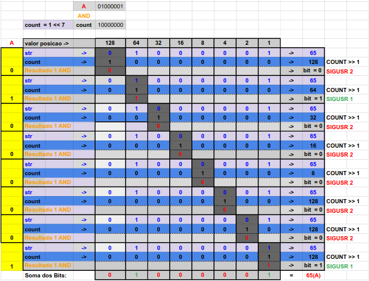
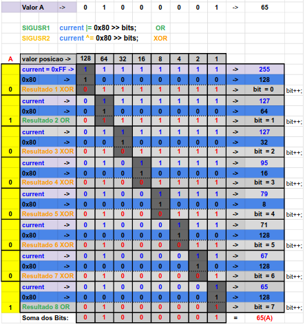

# Minitalk

The purpose of this project is to code a small data exchange program using UNIX signals.

```bash
**Mandatory Part**
• You must create a communication program in the form of a client and server. 
• The server must be launched first, and after being launched it must display its PID.
• The client will take as parameters:
• The server PID.
• The string that should be sent.
• The client must communicate the string passed as a parameter to the server.
• Once the string has been received, the server must display it.
• Communication between your programs should ONLY be done using UNIX signals.
• The server must be able to display the string pretty quickly. By quickly we mean that if you think it is too long,
  then it is probably too long (hint: 1 second   for 100 characters is COLOSSAL)
• Your server should be able to receive strings from several clients in a row, without needing to be restarted.
• You can only use the two signals SIGUSR1 and SIGUSR2.

**Bonus**
• The server confirms every signal received by sending a signal to the client.
• Support Unicode characters!

O objetivo deste projeto é codificar um pequeno programa de troca de dados usando sinais UNIX.

**Parte obrigatória**
• Você deve criar um programa de comunicação na forma de cliente e servidor.
• O servidor deve ser iniciado primeiro e, após ser iniciado, deve exibir seu PID.
• O cliente terá como parâmetros:
• O PID do servidor.
• A string que deve ser enviada.
• O cliente deve comunicar a string passada como parâmetro ao servidor.
• Uma vez recebida a string, o servidor deve exibi-la.
• A comunicação entre seus programas deve ser feita APENAS usando sinais UNIX.
• O servidor deve ser capaz de exibir a string rapidamente. Por rapidamente queremos dizer que se você acha que é muito longo,
  então provavelmente é muito longo (dica: 1 segundo para 100 caracteres é COLOSSAL)
• Seu servidor deve ser capaz de receber strings de vários clientes seguidos, sem precisar ser reiniciado.
• Você só pode usar os dois sinais SIGUSR1 e SIGUSR2.

**Bônus**
• O servidor confirma cada sinal recebido enviando um sinal ao cliente.
• Suporta caracteres Unicode!
```

## Bitwise Client


## Bitwise Sever


## Badge


## Skills
- Unix
- Rigor

# Demo


## My grade


## Cloning

git clone https://github.com/jorgeedualves/minitalk.git <br>
cd 42-minitalk <br>
make <br><br>

## Compiling

First you launch server: <br>
$ ./server <br>
Server will print its PID and wait <br>

So you use the client to send string or unicode characters to the server <br>
$ ./client `PID_SERVER` `STRING` <br><br>


### Made with: <br/>
### Jorge Alves
<div style="display: inline_block">
 <a href="https://github.com/jorgeedualves/jorgeedualves" target="_blank"></a>
 <a href="https://www.linkedin.com/in/jorge-eduardo-alves-094b4331/" target="_blank"></a> 
</div>

### Alfredo Neto
<div style="display: inline_block">
 <a href="https://github.com/Alfredo-Neto" target="_blank"></a>
 <a href="https://www.linkedin.com/in/alfredo-neto-a2515814b/" target="_blank"></a> 
</div>

### Alexandre Zamarion
<div style="display: inline_block">
 <a href="https://github.com/alezamarion" target="_blank"></a>
 <a href="https://www.linkedin.com/in/alexandre-zamarion-cepeda-a3766323a/" target="_blank"></a> 
</div>
